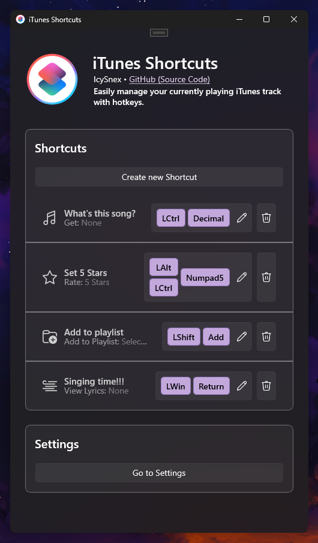

# iTunes Shortcuts Manager

iTunes Shortcuts Manager is a Windows application developed in C# and WinUI 3 that allows users to easily manage their currently playing iTunes tracks using customizable hotkeys.

---

## Features

- **Customizable Hotkeys**: Users can define custom hotkeys for various actions such as getting current track infos & controlling media playback, adding the current track to a playlist, rating the track, and viewing lyrics.
- **Flexible Configuration**: The application provides a user-friendly interface for adding and configuring shortcuts, including options for specifying key combinations, action types, and parameters.
- **Visual Feedback**: Default Windows notifications are utilized to provide visual feedback when a hotkey is triggered, ensuring users are aware of the actions performed.
- **Simple Installation**: Users can simply extract the zip file and run the program without any complicated setup process.
- **Integration with iTunes**: The application is designed specifically for iTunes, providing seamless integration and enhanced control over the iTunes library.

---

## Screenshots

Here are some screenshots showcasing the interface of iTunes Shortcuts Manager:

### Pages:
<table>
  <tr>
    <td></td>
    <td></td>
    <td></td>
  </tr>
</table>

### Notifications:
<table>
  <tr>
    <td></td>
    <td></td>
    <td></td>
    <td></td>
  </tr>
</table>

---

## Usage

1. **Installation**: Download the application from the GitHub repository and extract the zip file.
2. **Configuration**: Launch the application and navigate to the home page to add new shortcuts. Customize the shortcut name, action, parameters, key, and modifier according to your preferences.
3. **Managing Shortcuts**: Once configured, the application will run in the background, allowing you to easily manage your iTunes tracks using the defined hotkeys.

---

## System Requirements

- Windows 10 or later
- iTunes installed (if intending to use with iTunes)

---

## Dependencies

The application relies on the following dependencies:
- CommunityToolkit.Mvvm (v8.2.2)
- H.NotifyIcon (v2.0.124)
- Microsoft.Extensions.Hosting (v8.0.0)
- Microsoft.Extensions.Hosting.Abstractions (v8.0.0)
- Microsoft.Graphics.Win2D (v1.0.5.1)
- Microsoft.WindowsAppSDK (v1.4.240211001)
- Microsoft.Windows.SDK.BuildTools (v10.0.22621.2428)
- Serilog (v3.1.1)
- Serilog.Extensions.Hosting (v8.0.0)
- Serilog.Sinks.Debug (v2.0.0)
- Serilog.Sinks.File (v5.0.0)
- 
---

## Contributing

Contributions to the project are welcome! If you have any feature requests, bug reports, or suggestions for improvements, feel free to open a new pull request or issue on GitHub.

## License

This project is licensed under the [AGPL-3.0 License](LICENSE).
